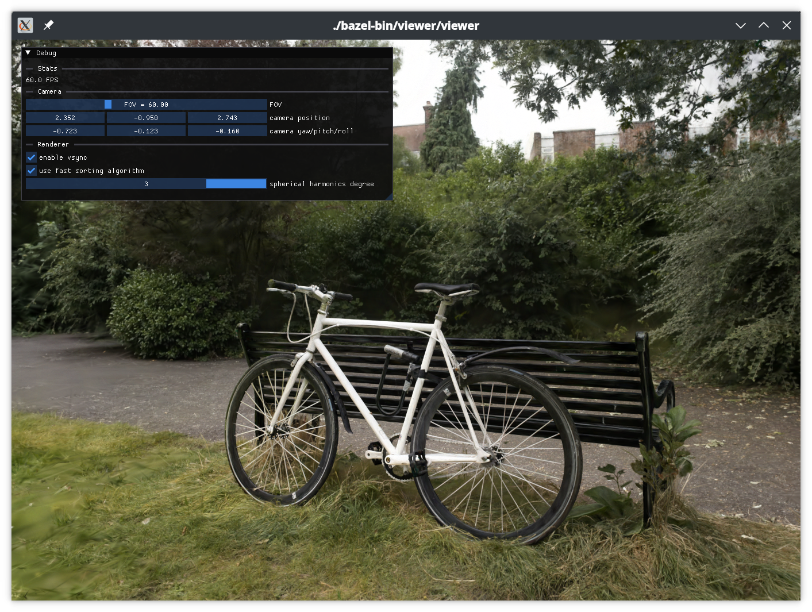

# 3D Gaussian Splatting Viewer

A simple OpenGL-based utility to render 3D Gaussian Splatting scenes (no CUDA).

Shaders and sorting taken from [Kevin Kwok's WebGL
implementation](https://github.com/antimatter15/splat) with some modifications
to improve efficiency (update only the rendering order instead of recomputing
and updating every splat) and support for view-dependent color.



## Building & Running

GLFW3 must be installed (on nix, run `nix develop`), and OpenGL 4.3 or later is
required.

Other dependencies are handled by Bazel:
```
bazel run //viewer /path/to/splat.ply
```
